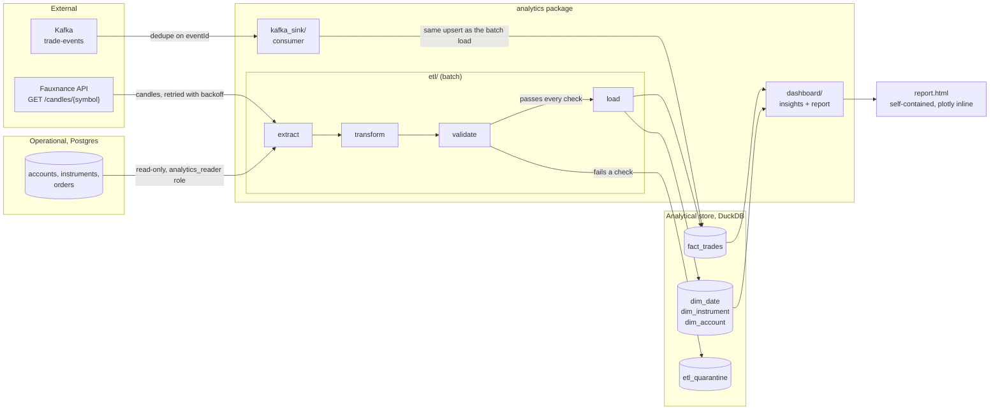

# Analytics

Python 3.12+ package covering the Sprint 4 and Sprint 7 capstone analytics work: the batch ETL, the Sprint 4 dashboard, and the Sprint 7 streaming sink. See `docs/ARCHITECTURE.md` for how this package sits inside the platform and `docs/contracts/analytics-schema.sql` for the star schema it loads.

## Why this package is shaped this way

The operational database answers "what is my balance right now" and has to answer it in milliseconds. It cannot also answer "what did the desk trade last quarter" without slowing down order placement, because that question means a full scan and an aggregate. `docs/ARCHITECTURE.md` calls this the operational and analytical split, and this package is the analytical half of it: a batch pipeline that reads Postgres on a schedule, a warehouse shaped as a star rather than a normalised form, and a dashboard that only ever reads the warehouse, never Postgres.

Sprint 4 builds the first version of this, reading Postgres directly because the warehouse does not exist yet. Sprint 7 moves the dashboard onto the warehouse and adds a second, optional way to get data into it: consuming `trade-events` off Kafka as fills happen, so the dashboard is not always a batch cycle behind. The batch load stays the source of truth. The streaming sink reconciles against it rather than replacing it, because `trade-events` alone cannot recover a message it never received, and a nightly extract from Postgres always can.

## Pipeline architecture



## Sprint 4 against Sprint 7

| Component | Sprint | What it does | What changes between the two sprints |
|---|---|---|---|
| `etl/extract.py`, `etl/transform.py` | 4 | Reads accounts, instruments and orders from Postgres, pulls EOD candles from Fauxnance, reshapes both into the star schema. | Unchanged in Sprint 7. The extract queries always read the operational database; that does not stop being true when the warehouse arrives. |
| `etl/validate.py`, `etl/load.py` | 4, hardened in 7 | Runs the pre-load checks (referential integrity, positive quantity and price, valid enums, a recomputed `trade_value`), quarantines what fails, upserts what passes into DuckDB. | Sprint 4 introduces the checks. Sprint 7 adds the incremental watermark (`etl_watermark`) and the idempotent upsert on `source_order_id`, so `etl run` on a schedule stops re-processing the whole table every time. |
| `dashboard/insights.py`, `dashboard/report.py` | 4 | Six business insights over the star schema, rendered as one self-contained HTML file. | Sprint 4 points the dashboard at whatever the ETL last loaded from Postgres directly, run by hand. Sprint 7 is the point past which the dashboard must read only the warehouse, per `docs/ARCHITECTURE.md`: "Never point the dashboard at the operational database after Sprint 7." Nothing in `dashboard/` talks to Postgres at any point; this package draws that line from the start. |
| `kafka_sink/consumer.py` | 7 | Consumes `trade-events`, appends fills, rejects and cancels to `fact_trades` as they happen. | Does not exist before Sprint 7: there is no event backbone until then. It exists so the dashboard can reflect activity between batch runs, per the Sprint 7 requirement that the dashboard consumes both a real-time and a batch source. |
| `fauxnance/client.py` | 4 | `GET /candles/{symbol}` with retry and backoff, the key read from the environment. | Unchanged. The Trade Executor and the market-data poller call different Fauxnance endpoints and live in other packages; this client only ever calls the candles endpoint. |

## Layout

```
analytics/
  src/analytics/
    config.py            environment settings, one dataclass per concern
    seed_universe.py      the canonical symbols and account ids used in tests and fixtures
    db/
      schema.sql          DuckDB DDL: the four contract tables plus pipeline-owned additions
      warehouse.py         DuckDB connection, schema application, surrogate key allocation
      operational.py       read-only SQLAlchemy engine onto Postgres
    fauxnance/
      client.py            candles client with retry and backoff
    etl/
      extract.py, transform.py, validate.py, load.py, watermark.py, pipeline.py
    dashboard/
      insights.py           the six business insights
      report.py             assembles the self-contained HTML report
      palette.py             fixed chart colours
    kafka_sink/
      consumer.py            trade-events into fact_trades, deduped on eventId
    cli.py                  etl / dashboard / kafka-sink entry points
  tests/                   pytest, no network, no live Postgres or Kafka
```

## The warehouse tables

The four tables in `docs/contracts/analytics-schema.sql` (`dim_date`, `dim_instrument`, `dim_account`, `fact_trades`) are reproduced in `src/analytics/db/schema.sql` without alteration to columns, types or keys. Three more tables exist only to run the pipeline and are not part of the contract:

| Table | Purpose |
|---|---|
| `etl_watermark` | The incremental cursor `etl run` uses, one row per pipeline. |
| `etl_quarantine` | Rows that failed a pre-load check, with a reason, so a batch failure is diagnosable rather than silent. |
| `kafka_processed_events` | The `kafka_sink` idempotency guard, keyed on `eventId`, per the processed-events mechanism in `docs/contracts/kafka-topics.md`. |
| `stg_market_candles` | A cache of Fauxnance candles, used only by the soft reasonableness check that flags a fill priced outside the day's traded range. Nothing in the dashboard reads it. |

## Running it

Install with `uv` (or `pip install -e ".[dev]"`):

```bash
cd analytics
uv sync --extra dev
```

Run the batch pipeline:

```bash
uv run etl run                          # incremental load since the last watermark
uv run etl backfill --from 2026-01-01 --to 2026-03-31
uv run etl validate                     # row counts, nulls, referential integrity, a reconciliation against Postgres
```

Build the Sprint 4 report:

```bash
uv run dashboard --output report.html
```

Run the Sprint 7 streaming sink (requires a reachable Kafka broker; not exercised in the test suite):

```bash
uv run kafka-sink
```

Run the tests:

```bash
uv run pytest
```

Every test runs against an in-memory or temporary-file DuckDB warehouse and a faked HTTP layer for Fauxnance. None requires a running Postgres, Kafka broker, or network access.

## Environment variables

| Variable | Default | Used by |
|---|---|---|
| `PG_HOST` | `localhost` | `etl` extract, connecting to the operational database |
| `PG_PORT` | `5432` | `etl` extract |
| `PG_DATABASE` | `trading` | `etl` extract |
| `PG_USER` | `analytics_reader` | `etl` extract. The role documented in `docs/contracts/database-schema.sql`, granted `SELECT` only. |
| `PG_PASSWORD` | *(none)* | `etl` extract. Never commit a value; set it in the environment or a local, gitignored `.env`. |
| `FAUXNANCE_BASE_URL` | `https://y4t9nq2bqf.execute-api.eu-west-2.amazonaws.com/v1` | `fauxnance.client`, candle extract |
| `FAUXNANCE_API_KEY` | *(none)* | `fauxnance.client`. Required for the candle pull; the pipeline skips it and logs a warning if unset, rather than failing the whole batch. |
| `FAUXNANCE_TIMEOUT_SECONDS` | `10` | `fauxnance.client` |
| `FAUXNANCE_MAX_RETRIES` | `4` | `fauxnance.client` |
| `DUCKDB_PATH` | `warehouse.duckdb` | `db.warehouse`, the analytical store file |
| `KAFKA_BOOTSTRAP_SERVERS` | `localhost:9092` | `kafka_sink` |
| `KAFKA_TRADE_EVENTS_TOPIC` | `trade-events` | `kafka_sink` |
| `KAFKA_CONSUMER_GROUP` | `analytics-loader` | `kafka_sink`. Matches the group named for the Python ETL in `docs/contracts/kafka-topics.md`'s producer and consumer matrix. |
| `ETL_DIM_DATE_FROM` | `2018-01-01` | `etl.pipeline`, the start of the pre-populated `dim_date` range |
| `ETL_DIM_DATE_TO` | `2032-12-31` | `etl.pipeline`, the end of the pre-populated `dim_date` range |

## The five insights the dashboard ships with

`dashboard/insights.py` computes six; the brief asks for at least five. Each chart's title is the finding itself, not an axis label, computed from whatever is currently loaded rather than hard-coded:

1. **Daily trade volume trend.** For example, "Daily order volume grew 42 percent from the first half of the window to the second."
2. **Most active accounts.** For example, "The top 3 accounts generate 78 percent of order flow."
3. **Fill rate.** For example, "83 percent of orders placed end up filled." Rejected and cancelled orders are loaded into `fact_trades` specifically so this is answerable.
4. **Exposure by instrument.** For example, "AAPL accounts for 34 percent of total exposure." Sums `trade_value`, never `price`.
5. **Average trade size.** For example, "The average order is worth $12,430." Averages `trade_value`, not `price`, for the same reason.
6. **Buy and sell balance.** For example, "Buy orders make up 61 percent of order flow."

## Data quality and idempotency

Every check named in `docs/contracts/analytics-schema.sql`'s "LOAD ORDER AND DATA QUALITY" section runs in `etl/validate.py` before a row reaches `fact_trades`: referential integrity into all three dimensions, positive quantity and price, valid `side` and `status`, and a `trade_value` recomputed from its inputs rather than trusted. A row that fails any check is quarantined with a reason, not silently dropped and not allowed to fail the whole batch.

The load is idempotent in three different ways, because three different things can repeat:

- **A whole batch re-run** (`etl run` twice with no new data): `fact_trades` and the dimensions upsert on their natural keys, so nothing is inserted twice.
- **An order's status changing between runs** (`NEW` becoming `FILLED`): the upsert on `source_order_id` updates the existing row in place and keeps its `trade_key`, rather than inserting a second row for the same order.
- **A duplicate Kafka delivery**: `kafka_sink` checks `kafka_processed_events` for the `eventId` before doing anything, per the at-least-once guarantee in `docs/contracts/kafka-topics.md`.

## Known limitations

`kafka_sink` sets `fact_trades.created_at` from the trade-event's `executedOn`, because `trade-events` does not carry the order's original `createdOn`. This is a deliberate approximation for real-time visibility: the next batch run re-extracts the order from Postgres and overwrites `created_at` with the authoritative value on the same upsert key. A reader who needs an exact `created_at` before the next batch run should treat a Kafka-sourced row's date as provisional.
